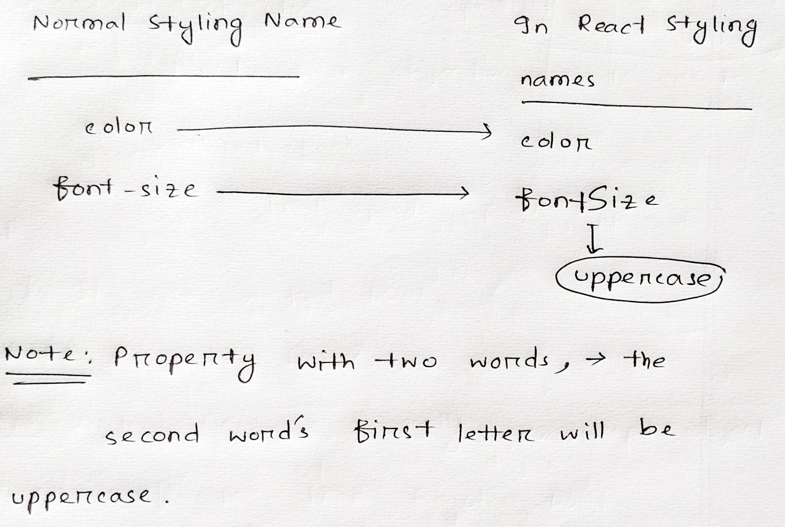
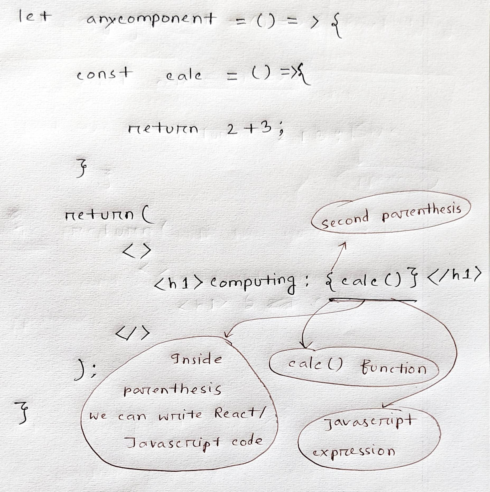

## Table of content
1. [React.js Installation Basic](#react-installation-basic)  <br>
1. [React Installation With Typescript](#react-installation-with-typescript)  <br>
2. [React Router Setup](#installation-react-router) <br>

3. [What is React?](#what-is-react) <br>
4. [Why use React?](#why-react)
5. [Importing React Libraries](#importing-react-libraries)
6. [React Rendering](#react-rendering)
7. [React Component](#react-component)
8. [Function Component](#function-component)
9. [JSX](#jsx)
10. [JSX Styling](#jsx-styling)
11. [Javascript inside of JSX](#javascript-insideof-jsx)
12. [Props React](#props-react)
13. [State: A Component's Memory](#state-a-components-memory)
14. [State As Snapshot](#state-as-snapshot)
15. [Queueing a Series of State Updates](#queueing-a-series-of-state-updates)
16. [Updating objects in state](#updating-objects-in-state)
17. [JSX Styling](#jsx-styling)
18. [JSX Styling](#jsx-styling)
19. [JSX Styling](#jsx-styling)
20. [JSX Styling](#jsx-styling)

> Note that same page section URL can't contain (.)-dot. I saw the links didn't work when I put . in the link at the part that start with # . 


 
 
 # React Installation Basic
 =============================================================================
 ### Installation
 * Go to terminal 
 * Run this code in the terminal:

```console 
npx run create-react-app any-name
```

 > this command will create a new folder in the workspace folder named `any-name`. Notice that this is the name I gave it in the command terminal.
It can be any name.

<br>

### Run React Application
After downloading react framework, the next step is to **run it**  <br>
Go to terminal and run it.

```console
npm start
```
> a new webpage will open under local server at port 3000, in the browser.

<br>
<br>
<br>

 # React Installation With Typescript
 =====================================================
 * Create new app with typescript
 ```console
 npx create-react-app my-app --template typescript
 ```
 
 * Convert current project in typescript
  ```console
npm install --save typescript @types/node @types/react @types/react-dom @types/jest
 ```
✔️ After the installation, rename the `.js` extension to `.tsx`. <br>
✔️ Then restart the development server.

> Remember its TSX. not TS.

yet needs to be EXPERIMENTED


<br>
<br>


# Installation React Router

#### here is the link to the react router section
https://github.com/MahinulAbid2/React-Router/tree/main


<br>
<br>


# What is React
=======================================================================================
### Website Navigation
### Website Footer
These are some reuseable `components` that we need to use the same code everytime.
> Rewriting the same HTML over and over again is a bad thing. 

* **PHP** Helps us overcome that issue with the help of `include`. <br>

React is a JavaScript library developed by Facebook which, among other things, was used to build Instagram.com. Its aim is to allow developers to easily create fast user interfaces for websites and applications alike.

### React's Main objective:
* It's main objective is to speed up **large complex website** using `Virtual DOM(Javascript Obejct)`. 

### What is virtual DOM?
<b> Answer: </b> Virtual DOM is basically javascript obejct which is faster than the normal DOM.

<br>
<br>

# Why React
==========================================================================================
❎ For `small static website`, working with `vanilla Javascript` is not a big issue.

✅ A complex web app <br>
✅ Which requires heavy element change, data change <br>
✅ & Faster laoding  <br>
✅ Updates without reloading. <br>
✅ With `React-router`, we can navigate from path to another path without reloading browser. <br>

<br>
<br>

✅ It loads all the component on something called `virtual-memory`. <br>
✅ The website renders the whole thing at the begining. <br>
✅ Then it just re-renders just those components which data, or something is changed. Rest of the elements are just the don't
re-render like normal static HTML website. <br>


<br>
<br>
<br>

✅ When building large websites, you’ll find that almost all the time you’re `repeating certain patterns`. <br>
✅ In React, you can **group those patterns** in a `component` and reuse them again and again. <br>
✅ Imagine you’re building a `blogging website` and need to display cards of blog posts on your page. <br>


<br>
<br>


# Importing React Libraries
===============================================================

At first, 
* The file `index.js` is the file where all the other component will render.

### Importing React in file.
* It's important to import React module in the file at the `top`.

```jsx
import React, { useState } from "react";
//react module is the critical part of any react application. importing it at the top of all is must in every file.
// useState is the import part of React Hooks. Why React Hooks?
// When you use functional components in react, react hooks is a must.

import ReactDOM from 'react-dom';
//ReactDOM is a package that provides methods to interact with the Document Object Model (DOM) in a React application.
//Down below there is another alternative of importing ReactDOM.

import ReactDOM from "react-dom/client"
// Why use react-dom/client over just "react-dom"?
/* The client subdirectory contains a smaller and more focused set of methods than the main ReactDOM library, and is optimized 
 for client-side rendering. It includes only the methods necessary for rendering components on the client side, and excludes 
 some of the server-side methods that are not relevant in a client-side environment.*/
 
/* Importing ReactDOM from the client subdirectory can be useful in situations where you are trying to optimize your bundle size or 
improve performance. By importing only the necessary methods from ReactDOM, you can reduce the size of your application bundle, 
which can improve the loading time of your web page.*/

//IMPORTING JSX component
import Anyname from './App';
// I imported a react component file and I can give it any non-re-useable name to call it in action.

//Importing any css file is way too easy
import './index.css'; 
//no extra work.

```

<br>
<br>


# React Rendering
==========================================================================================================
* Remember, React takes all the component and `renders` into a single page.

```JSX
import React from 'react';
import ReactDOM from 'react-dom/client';

function Greeting(props) {
  return (
    <div>
      <h1>Hello, {props.name}!</h1>
      <p>{props.message}</p>
    </div>
  );
}

const root = ReactDOM.createRoot(document.getElementById('root'));
//this root selects element from the path public/index.html > there you will find a <div id="root"> </div>. 
// It selects that div and renders every component on that one page when we call ".render" method BELOW.

root.render(
  <React.StrictMode> // the ".StrictMode" does not render anything, it checks for additional mistakes and warning.
    <Greeting /> // here I only rendered Greeting component. This Greeting component can include another component. That component can include another component.
  </React.StrictMode>
);
```

<br>
<br>

# React Component
=========================================================================================
React is all about component.
* There are two types of component.
 1. Class Component
 2. Function Component
 
> `Class Component` is complex and old. Where `function component` is clean but it needs `react-hooks`

I won't note `class Component`. It will all about `function component`.

<br>
<br>


# Function Component
==============================================================================================
A function component always starts with a function which will have a function name.

### Note that `Rect Component`'s name's first letter should always start with `UPPERCASE`.
* Function Component can be written in **two ways**.
* Basic structure of function component:

```JSX
//FIRST WAY
// using arrow function method.
const Demo=()=>
{

return (
<>
<h1>Welcome to GeeksforGeeks</h1>;
</>
)
}


//SECOND WAY
// using the old function 
function Parentheses() {
return ( 
<>
 <h1> As usual we can call the function using name of the function followed by Parentheses </h1>
</>
);
}
```

<br>

* All other javascript operation can be done inside of react component.
* It needs to be specific place.

### Calling function components
After creating function component, it can be called so that react can render it.
* Either call the component in root.render() function.
* Or let another rendering component call this component.

```JSX
import React, {useState} from 'react';
import ReactDOM from 'react-dom';

const Demo=()=>{
return (
  <>
  <h1>Welcome to GeeksforGeeks</h1>;
  </>
)
}


function Parentheses() {
return ( 
  <>
  <h1> A normal heading </h1>
  <Demo /> 
  </>
 );
}
// I called DEMO component in another component.
 
const root = ReactDOM.createRoot(document.getElementById('root'));
root.render(
  <React.StrictMode> 
    <Parenthesis /> //Rendering PARENTHESIS compoenent which included another component <Demo />.
  </React.StrictMode>
)
```


<br>
<br>

# JSX
=====================================================================================================
* JSX = JSX stands for JavaScript XML
* JSX allows us to write HTML in React
* JSX makes it easier to write and add HTML in React.


### Rules of JSX
---------------------------------------------
* JSX can have only `one parent element`.
```JSX
//WRONG WAY
// no parent element. It would be okay if there was just one element.
// More than one element? It needs a parent element.
<h1> Hello heading 1</h1>
<p> Hello Paragraph </p>

//RIGHT WAY
// there is one parent element. It can be empty tag.
<>
<h1> Hello heading 1</h1>
<p> Hello Paragraph </p>
</>
```

* In JSX every tag needs to have `ending tag`. Even `single tag` needs to have proper ending.
```JSX
<br /> 

//proper ending of single tag. Adding that slash at the end.
```
* JSX all the tag attribute are same except `class` attribute.
* In JSX, it is used `className` instead of `class`.

```JSX
<div className="hero-text"> </div>
```

* In function component, JSX can only contain in `return()` element.
* JSX comments, the only one - `/* only JSX comments syntax */`.

### JSX styling
---------------------------
* One important styling is inside component.
* **Careful** about the property name of style. Its a little different than Normal CSS.



<br>
<br>


* **Styling inside component** - we write it before `return()` method. & After declaring the function compoenent.


```jsx
const Hello = () => {
  const styleings={
    color:"green",
    fontSize: "120px" /* here the second word of property is Uppercase*/
  }
  // This stylings is just an javascript object. NOTHING ELSE
  
  return(
    <>
      <h1 style={styleings}>Hello world</h1>
    </>
  )
}
```

* Another way to use style is `linking it` via `import`.
```jsx
import "../css/anycssfile.css";
//position: after react import
```

<br>

### Javascript inside of JSX
--------------------------------------------------
* You can write React/Javascript inside of JSX
* if-else statements **don't work** inside JSX.
* JSX is fundamentally `syntactic sugar`. After compilation, JSX expressions become regular JavaScript function calls and <br>
evaluate to JavaScript objects.
* We can embed `any JavaScript expression` in `JSX` by wrapping it in `curly braces`.
* Just `ternary` if-else is allowed.

<br>



> The syntax is `{}`

<br>
<br>
<br>


### Whole file structure
-------------------------------------------------
```jsx
import React, {useState} from 'react';
import ReactDOM from 'react-dom';

const Demo=()=>
{
return (
<>
<h1>a heading from compnent </h1>;
</>
)
}

function Parentheses() {
  return ( 
  <>
    <h1> A normal heading </h1>
    <Demo /> 
  </>
  );
}

 
const root = ReactDOM.createRoot(document.getElementById('root'));
root.render(
  <React.StrictMode> 
    <Parenthesis /> 
  </React.StrictMode>
)
```

<br>
<br>
<br>

# Props React
====================================================================
* `props` stands for - Properties.

* Props are the information that you pass to a JSX tag. For example, className, src, alt, width, and height are some of the props you can pass to an 
```jsx
function Avatar() {
  return (
    
  );
}
```

<br>

<br>
<br>

> Using this props functionality `React Component` can `transfer information` from one component to another.

**What is `props`**
* `props` is basically an object.
* Using this, React Component transfer information from one component to another.
* Every <ins>PARENT COMPONENT</ins> can pass some information to its <ins>CHILD COMPONENT</ins> by giving them `props` object.
* Props might remind you of <ins>HTML attributes</ins>, but you can pass any JavaScript value through them, including `objects`, `arrays`, and `functions`.
* `Props` are the only argument to your `component`!


<br>
<br>

## Props Object
* React component functions accept a single argument, a `props object`.
```jsx
function Avatar(props) {
  // ...
}
```

<br>
<br>

* Usually you don’t need the whole props object itself, so you destructure it into individual props.
```jsx
function Avatar({ person, size }) {
  // ...
}
```
`Now I know the basic structure of the PROPS argument.`

<br>

### Components Pattern
There is a specific way components pass information.
* There is a flow of data from `component` to `component tag`.
* Imagine `component` has a `initialized variable` and those variable has no value. 
* Then we give those variable a value when we call the `component` in `another component`.

```jsx
// here is a function component
const App =({name, age})=>{
// imagine this "name", "age" are initialized variable which doesn't have a value.

 return(
  <>
   <h1> Hello {name}, Good Morning </h1>
   <p> You are {age} years old. </p>
  </>
 )
 // these "name", "age" are changeable data while rendering.
}


// this is another component which will be rendered
const RenderingApp = ()=>{
 return(
 <>
  <h1> Mother component </h1>
  
  // calling the another component which has initialized without any value.
  // those variable will get value here.
  <App name="john" age={20} />
  // the age can be a string 20. I choose to put number data type.
  // which means I can also put javascript inside there without if else, loop etc.
 </>
 )
}
```

<br>
<br>

### If i define it in regular javascript function 
It will be something like this

```javascript
const App =(name, age)=>{
 console.log(`Hello ${name}, how are you?`);
  console.log(`Your age is ${age}`);
}


const AnotherApp = ()=>{
 App("john", 20);
 // the idea is something like this. But the "rendering method" is absent here. 
 // in react, the component take that other function's work and make them its own work.
 // which means take its other component and make it its own.
}
```

<br>
<br>
<br>


# State: A Component's Memory
===============================================================================

* Components often need to change what’s on the screen as a result of an interaction. 
    - Typing into the form should update the input field
    - clicking “next” on an image carousel should change which image is displayed
    - clicking “buy” should put a product in the shopping cart
    
    <br>
    <br>

* Components need to “remember” things: the current input value, the current image, the shopping cart. 
* React, this kind of component-specific memory is called state.


<br>
<br>

### Why state?
**This function below updtaes DOM everytime I press the button**.


#### Pure javaScript
> Here I'm creating a button that update its content by number everytime I click it using pure JAVASCRIPT.

```html
<!-- HTML FILE -->
<button> 0 </button>
```

```javascript
// JAVASCRIPT FILE
let x = document.querySelector("button");
let index=1;

const Increment =()=>{
  index++;
}

x.addEventListener("click", ()=>{
  Increment();
  x.innerHTML=`${index}`;
})
```

> This function will update DOM elements with the incremented number everytime I click the button.

<br>
<br>

#### Trying to achieve the same thing using REACT
Here I'm trying to create the same function using React, using the same pattern.

```jsx
const App = ()=>{
  let index=1;
  const x =()=>{
    index++;
  }

  return(
    <>
      <button onClick={x}>{index}</button>
    </>

  );
}
```

# This won't work. WHY?

* The handleClick event handler is updating a local variable, index. But two things prevent that change from being visible.
* Local variables don’t persist between renders.
*  When React renders this component a second time, it renders it from scratch—it doesn’t consider any changes to the local variables.
* Changes to local variables won’t trigger renders. React doesn’t realize it needs to render the component again with the new data.

<br>
<br>

**<ins>To update a component with new data, two things need to happen:</ins>** <br>


1. Retain data between renders
2. Trigger React to render the component with new data (re-rendering).

<br>
<br>

### useState function
The useState Hook provides those two things: <br>
1. A state variable to retain the data between renders.
2. A state setter function to update the variable and trigger React to render the component again.

<br>

To use `useState` import this at the top of React:
```jsx
import {useState} from "react";
```

<br>

Then replace this line:
```jsx
let index = 0;
```
<br>

With This Line:
```jsx
const [index, setIndex] = useState(0);
```

* `index` is a `state variable` and `setIndex` is the `setter function`.
* The `[` and `]` syntax here is called `array destructuring` and it lets you read values from an array. The array returned by `useState` always has exactly `two items`.

<br>
<br>

### This is how useState works as a replacement to earlier REACT function:
```jsx
const App = ()=>{
  const [index, setIndex] = useState(0); 
  //this is the value of index which I put on useState(0);

  const x =()=>{
    setIndex(index+1);
    //updating the index value using setIndex method which is in that desctructing method of useState();
  }

  return(
    <>
      <button onClick={x}>{index}</button>
    </>

  );
}
```

<br>

* Remember, REACT does not re-render the component when a `local variable` is updated. 
* REACT only re-render its component when its `component memory variable` gets updated, react component re-render its component.
* When you call `useState`, you are telling React that you want this component to remember something.
```jsx
const [index, setIndex] = useState(0);
```
* In this case, you want React to remember index.
* The only argument to useState is the initial value of your state variable.
* In this example, the index’s initial value is set to `0` with `useState(0)`.


### Detail
* Every time your component renders, useState gives you an array containing two values:
   - The state variable (index) with the value you stored.
   - The state setter function (setIndex) which can update the state variable and trigger React to render the component again.

<br>

Here’s how that happens in action:
```jsx
const [index, setIndex] = useState(0);
```
* Your component renders the first time. Because you passed `0` to `useState` as the initial value for `index`, it will return `[0, setIndex]`. React remembers `0` is the latest state value.
* You update the state. When a user clicks the button, it calls `setIndex(index + 1)`. index is `0`, so it’s `setIndex(1)`. This tells React to remember `index` is `1` now and triggers another render.
* Your component’s second render. React still sees `useState(0)`, but because React remembers that you set `index` to `1`, it returns `[1, setIndex]` instead.

<br>
<br>

### PITFALL(BAD practices)
* Hooks—functions starting with use—can only be called at the `top level` of your `components` or [your own Hooks](https://beta.reactjs.org/learn/reusing-logic-with-custom-hooks).
```jsx
const App = ()=>{
  const [index, setIndex] = useState(0); 
  // this is the TOP LEVEL of your component.
  // HOOKS FUNCTION CAN ONLY BE CALLED HERE

  const x =()=>{
    setIndex(index+1);
    //updating the index value using setIndex method which is in that desctructing method of useState();
  }

  return(
    <>
      <button onClick={x}>{index}</button>
    </>

  );
}
```
* You can’t call Hooks inside `conditions`, `loops`, or `other nested functions`.
* Hooks are functions, but it’s helpful to think of them as `unconditional declarations` about your component’s needs.
* You “use” React features at the top of `your component` similar to how you “import” modules at the `top of your file`.


<br>
<br>

# State As Snapshot
====================================================

#### what is snapshot?
* In computer systems, a snapshot is the state of a system at a particular point in time.
* It can refer to an actual copy of the state of a system or to a capability provided by certain systems.

<br>
<br>
<br>

1. State variable might look like regular JavaScript variables that you can read and write to. 
```javascript
let x= 2;
// this variable is read and writeable.
// I can change the value from 2 to 19 or "john"

x= "john";
x= false;
// I can write the value of x, change it.
```
<br>

2. However, state behaves more like a snapshot.
```jsx
//what do I mean by snapshot?
let x= 2;

//this x variable is just read-only.
// snapshot means something like that.

```
3. Setting it does not change the state variable you already have, but instead triggers a re-render.
```jsx
const [x, SetX]=useState("john");


//setting state inside of a component
setState("kate");
// this setState() doesn't change the X value. 
```
This `setState()` doesn't change the `x` value. That `x` value is `read-only`. <br>
This `setState()` only triggers `REACT` to re-render the component. <br>
**This is what `snapshot` means in state in REACT**.


<br>
<br>

1. I might think of your user interface as changing directly in response to the user event like a click.
2. In React, it works a little differently from this mental model. 
3. I saw that setting state requests a re-render from React.
4. This means that for an interface to react to the event, you need to update the state.


### Rendering Takes snapshot times
“Rendering” means that React is calling your component, which is a function. The JSX you return from that function is like a snapshot of the UI in time. Its props, event handlers, and local variables were all calculated using its state at the time of the render.

Unlike a photograph or a movie frame, the UI “snapshot” you return is interactive. It includes logic like event handlers that specify what happens in response to inputs. React then updates the screen to match this snapshot and connects the event handlers. As a result, pressing a button will trigger the click handler from your JSX.

<br>
<br>
 
**<ins>When react re-render a component?</ins>**
1. React calls your function again.
2. Your function returns a new JSX snapshot.
3. React then updates the screen to match the snapshot you’ve returned.


<br>
<br>
<br>

# Queueing a Series of State Updates
====================================================================

```jsx
import { useState } from 'react';

function Counter() {
  const [number, setNumber] = useState(0);

  return (
    <>
      <h1>{number}</h1>
      <button onClick={() => {
        setNumber(number + 1);
        setNumber(number + 1);
        setNumber(number + 1);
      }}>+3</button>
    </>
  )
}
```

<br>


<br>

**<ins>What do I think when I click the button +3?</ins>**

<ins>Answer</ins>: I might expect that clicking the `+3` button will increment the counter `three times` because it `calls` setNumber(number + 1) <ins>three times</ins>:


* React waits until all code in the event handlers has run before processing your state updates.
* This is why the re-render only happens after all these setNumber() calls.
* This might remind you of a waiter taking an order at the restaurant.
   -  A waiter doesn’t run to the kitchen at the mention of your first dish! Instead
   - they let you finish your order, let you make changes to it, and even take orders from other people at the table.


So when I click `+3` react reads all the setNumber(); and then re-render, which is something similar to this:
```javascript
setNumber(0 + 1);
setNumber(0 + 1);
setNumber(0 + 1);
```

* No matter how much I call, setNumber(); the initial number will be updated after the component re-renders.
* That is the main reason, when I click `+3`, it reads all the setNumber(); then it re-render.
* After that, the hooks updates the values to one.

>To be continued


<br>
<br>
<br>

# Updating Objects in State
* State can hold any kind of JavaScript value, including objects.
```jsx
const [position, setPosition] = useState({
    x: 0,
    y: 0
  });
```

* I remember that state variable are `read-only`(the initial value). Which means when we setState(), this doesn't change the initial value.
* Instead, this triggers REACT to re-render the component with new data.
* However, if state initial value holds an `object`, know that technically that object is mutable.
```jsx
const [x, setX] = useState({
   firstName: "john",
   age: 20
});


x.firstName="melly";
//technically this is possible.
// this is called mutation and this act can be only done by using object not primitive data type like string, number,boolean.
//down below is given example

const [x, setX] = useState("john");
//this "john" is not mutateable but any object is mutable which is shown up above
```

<br>
<br>

**<ins>However</ins>, react wants us to think asif the are immutable. Those objects I mean.**.

### which means treat state as `read-only`.

Which means do not change the `state initial value` <ins>directly</ins>. 
* Let the state initial object stay as it is.
* Use `setState()` to update `react-component-memory` not directly.
```jsx
const [x, setX]=useState({
   firstName:"john",
   age: 20
});


//don't mutate, use setState()
setState({
   firstName:"kate",
   age: 20
   //kindly rewrite the whole object again, since this is not mutating
   // this is updating the whole react component memory
})
```

<br>
<br>
<br>
<br>


# Responding to Events
=========================================================================================


